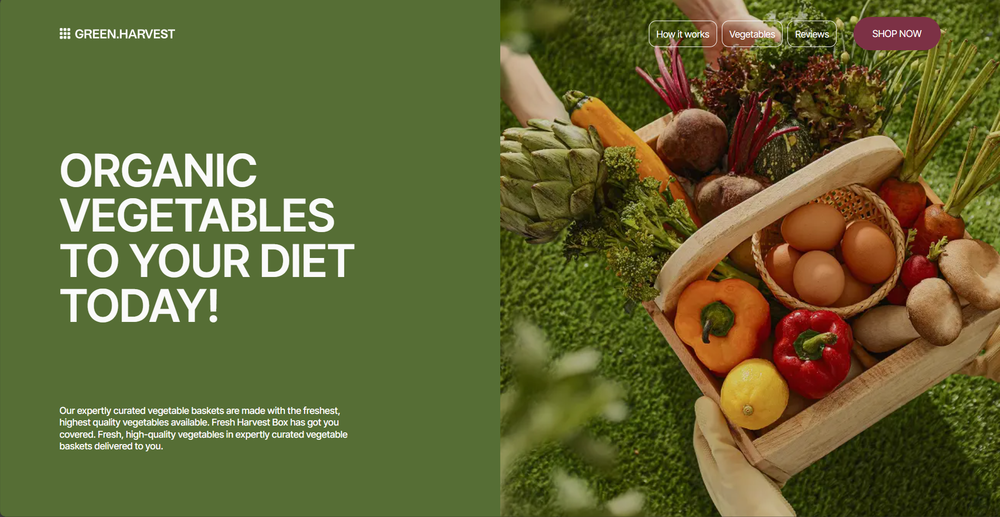
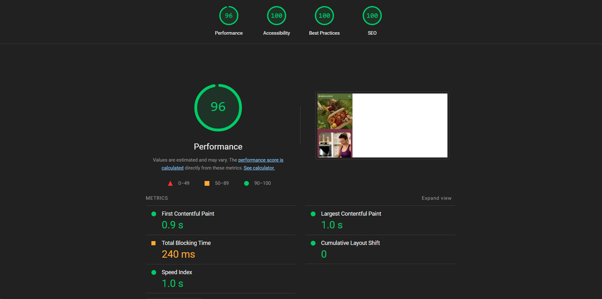

# Green Harvest

A modern, responsive landing page for a fresh produce delivery service built with Next.js, TypeScript, and Tailwind CSS. This project showcases a professional website with animations, interactive order forms, and optimized performance.



## 📋 Table of Content

- [Demo](#demo)
- [Features](#features)
- [Technologies Used](#technologies-used)
- [Installation](#installation)
- [Lighthouse Report](#lighthouse-report)
- [Contributing](#contributing)
- [License](#license)

## Demo

Live demo: [Green Harvest](https://green-harvest-tau.vercel.app/)

## Features

- **Modern Design** - Clean and professional UI for an organic produce delivery service
- **Fully Responsive** - Optimized for all device sizes (mobile, tablet, desktop)
- **Performance Focused** - Fast loading with lazy-loaded components and optimized images
- **Order Form** - Interactive form for customers to place orders
- **Product Showcase** - Beautiful display of organic vegetables
- **Customer Reviews** - Testimonials from satisfied customers
- **Animations** - Smooth motion effects with Framer Motion
- **SEO Friendly** - Optimized metadata and semantic HTML
- **Accessibility** - WCAG compliant design elements

## Technologies Used

- **Framework**: [Next.js](https://nextjs.org/) with App Router
- **Styling**: [Tailwind CSS](https://tailwindcss.com/)
- **Animations**: [Framer Motion](https://www.framer.com/motion/)
- **Form Handling**: Custom components for order submissions
- **TypeScript**: Type-safe code
- **Dynamic Imports**: Optimized loading with lazy components

## Installation

### Prerequisites

- Node.js 18.0 or later
- npm or yarn

### Setup

1. Clone the repository:

   ```bash
   git clone https://github.com/yamami-mohammed-monsif/green_harvest.git
   cd green_harvest
   ```

2. Install dependencies:

   ```bash
   npm install
   # or
   yarn install
   ```

3. Create a `.env.local` file if needed for environment variables:

   ```bash
   cp .env.example .env.local
   ```

### Development

Run the development server with Turbopack:

```bash
npm run dev
# or
yarn dev
```

Open [http://localhost:3000](http://localhost:3000) in your browser.

### Production Build

Build for production:

```bash
npm run build
# or
yarn build
```

Start the production server:

```bash
npm run start
# or
yarn start
```

## Lighthouse Report

This project has been optimized for performance, accessibility, SEO, and best practices.



## Contributing

Contributions are welcome! Please feel free to submit a Pull Request.

1. Fork the repository
2. Create your feature branch (`git checkout -b feature/amazing-feature`)
3. Commit your changes (`git commit -m 'Add some amazing feature'`)
4. Push to the branch (`git push origin feature/amazing-feature`)
5. Open a Pull Request

## License

This project is licensed under the MIT License - see the [LICENSE](/LICENSE.txt) file for details.
